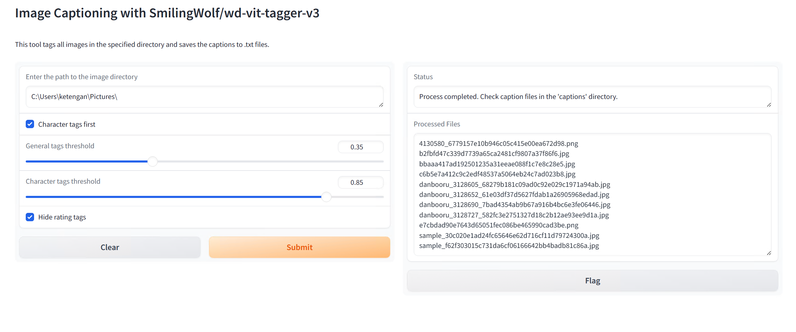

# wdv3-batch-vit-tagger

The successor of WD14 tagger. This batch tagger support wd-vit-tagger-v3 model by SmilingWolf which is more updated model than legacy WD14. Tested on CUDA and Windows

This script is to mass captioning the image on one directory. The captioned image file output is .txt with identical filename as the source image. The default output of the caption on ./caption folder

## Features
- **Supported models**: Latest WaifuDiffusion v3 tagger architecture. Currently this script only supporting SmilingWolf/wd-vit-tagger-v3 model
- **Output Files**: Currently the output is only .txt, user preferred extension will be added soon
- **Easy User Interface**: By utilizing gradio as user interface, the usage of this script should be easy
- **Hide Rating Tags**: You can choose optionally whether you want to output the rating tags (Like "General", "Explicit", "Quetionable", etc) or not by checklist the "Hide Rating Tags" box
- **Character Tags First**: This feature allow you to make the character name tag at the front before other tags like general, copyright or rating. This feature is very useful if you want to train the text encoder with "keep n tokens" function on the trainer
- **Hide the Separator**: This function will remove the separator "_" of the tags in the output caption
- **User Preffered Threshold**: Using the gradio slider, the user allowed to adjust the threshold of the tagger model

## How to run
Python 3.10 and CUDA GPU is required to run this script. You can download Python here https://www.python.org/downloads/windows/

Steps to run:
1. Clone this repository `https://github.com/Ketengan-Diffusion/wdv3-batch-vit-tagger.git`
2. Navigate to cloned directory `cd wdv3-batch-vit-tagger`
3*. Set up a virtual environment `python -m venv venv`
4*. Activate the new venv:
  - Windows: `venv\scripts\activate`
5. Install the requirements `pip install -r requirements.txt`
6. Run the script `python wdv3tagger.py`

*) Virtual environment is optional, you can skip into step 5 if you want to run directly on main OS environtment

## Disclaimer
This script still under development, other feature maybe will come soon.
This repository is inspired from original SmilingWolf/wd-tagger HF Demo, and adjusted to be used for local environtment and can captioning image batches
